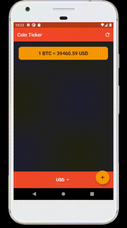

# Coin ticker

## Abstract
This project is a price tracker for some crypto / fiat currencies ! 

The idea of this app come from the challenge proposed in the London App Brewery's course "The Complete 2021 Flutter Development Bootcamp with Dart" directed by Dr. Angela Yu.
full course : [www.appbrewery.co](https://www.appbrewery.co/)

## Finished app

## Coin ticker features

### Course challenge features
- Retrieve current price for listed crypto currencies (3 for this challenge) in some fiat currencies from web (I personally used cryptocompare.com API);
- ability for user to select his fiat currency as reference (with a Dropdown button for Android users & CupertinoPicker for Ios users);

### Personal features
- add some others crypto currencies;
- add a refresh button into appbar;
- add a load indicator;
- add an error manager;
- possibility to "follow" crypto currencies
- store & retrieve into sharedPreferences followed crypto 

